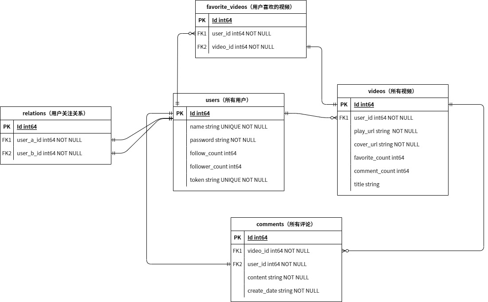

# mini-douyin
字节跳动青训营抖音项目

## IP、端口设置
服务器 IP：当前未到部署阶段，使用本地 IP（本地调试推荐使用 Android Studio。另外抖声 App 内服务器地址需要写全（例如：http://192.168.1.100:10250 ），否则会闪退）

服务器端口：10250 (HTTP)

MySQL 端口：3306 (TCP)

## 开发规范

### 语言

注释、commit 信息、README 均使用**中文**

### 命名

| 变量/文件                | 规则（所有均为单数形式）           |
| ------------------------ | ---------------------------------- |
| package                  | 全小写，无下划线                   |
| Go File                  | 全小写，有下划线                   |
| 常量、结构体、函数名     | 大驼峰，缩写全大写，无下划线       |
| 结构体内部变量           | 大驼峰，缩写只大写首字母，无下划线 |
| 结构体外与结构体相关变量 | 小驼峰，缩写只大写首字母，无下划线 |
| 一般变量                 | 小驼峰，缩写全大写，无下划线       |

## 数据库表关系图（ERD）

## 各模块信息
### 注册登录模块

- 密码使用 BCrypt 加密，数据库保存的是加密后的密码
- 每个用户的用户名唯一，作为数据库提取用户信息的判断依据
- 用户 Id（以及视频 Id）的增长方式：~~程序运行时分配两个变量从数据库中分别读取用户和视频的最后一个 Id，新创建时 Id 依次增加~~，GORM 默认下可以使主键自增

## 已知问题

- ~~userIdSequence 和 videoIdSequence 在多线程的环境下有可能产生重复（也许可加 mutex 解决，但会影响效率）~~